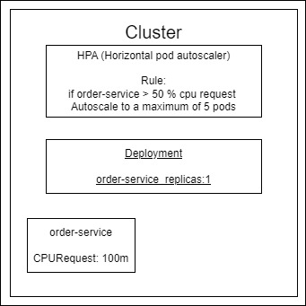

# Horizontal Pod Autoscaling
   

Получить информацию:
```bash
kubectl get hpa
kubectl describe hpa order
```

Создать hpa:
```bash
kubectl autoscale deploument order --cpu-percent 200 --min 1 --max 4
```
--cpu-percent 200 = 200% от cpu request контейнера 

Получить yml-манифест hpa:
```bash
kubectl get hpa order -o yaml
```