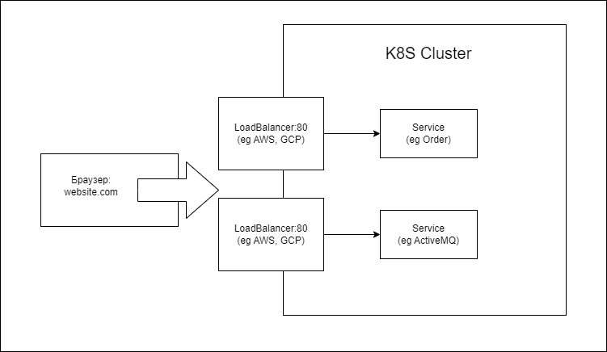

# Ingress
Существует доступ внешнего клиента к сервису в кластере через тип сервиса NodePort:
- NodePort - сервис будет доступен извне, необходимо указать порт (nodePort) и должен быть в диапазоне 30000-35000.

Обычно такой доступ к сервису используется в рамках тестирования.  

Для доступа внешнего клиента к сервису можно использовать Classic Load Balancer (предоставляется Облачным провайдером - AWS, GCP). Для этого сервис создается с типом LoadBalancer.   
   
Таким образом можно опубликовать внешний доступ к одному сервису.   

Опубликовать еще один сервис, потребует создания дополнительного Classic Load Balancer.  
Обычно публикуется больше одного сервиса. 
Пример: (Webapp сервис, ActiveMQ Concole, Grafana - мониторинг, Kibana - логирование и тп)    
   
#### Дополнительно
Существуют Application Load Balancer в которых можно задавать routing rules, LoadBalancer в зависимости от условий перенаправляет запрос в разные сервисы.

### Ingress Controller
В K8S если специальный сервис для доступа Load Balancer вместо прямого соединения с сервисами - Ingress Controller (в большинстве случаев Nginx)

> Ингресс — это правила доступа внешнего трафика внутрь кластера.  Контроллеры — это приложения, которые реализуют правила.