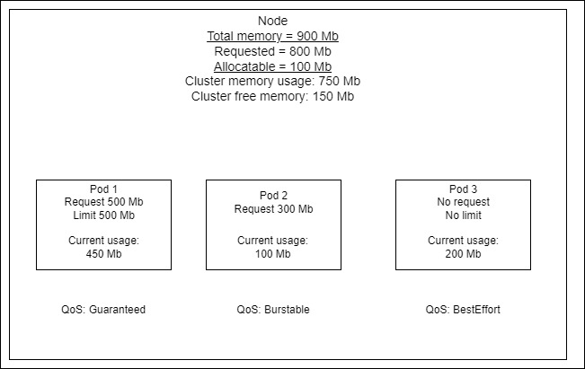
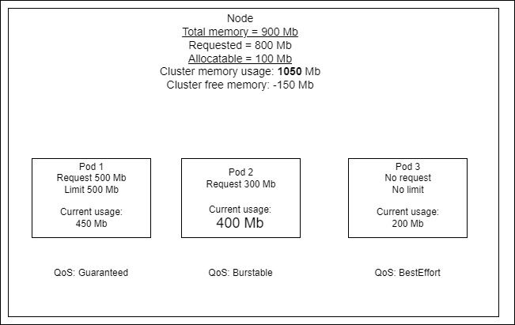

# Quality of Service
K8S помечает поды метками-классами в зависимости от того указаны ли Requests или Limits в описании:
 

Посмотреть QoS Class:
```bash
kubectl describe pod order
```
#### Eviction
В случае если в ноде не хватает места, то k8s scheduler будет извлекать поды, начиная с BestEffort, потом Burstable.  
Пример: Pod 3 будет перенесен из Node   
 

#### Priority
Возможно задавать класс приоритета со значением от 0 до 32-bit int.  
Пример: Если новому поду не хватает места в Node, но поле priority выше чем у работающего пода на Node, то работающий под будет перенесен.
