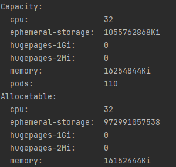
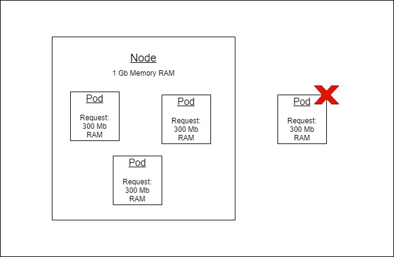

# Requests and Limits

Как правило, всегда возникает необходимость обеспечить выделенный пул ресурсов какому-либо приложению для его корректной и стабильной работы.   

### Получить информацию о Node
```bash
kubectl get nodes
kubectl describe node <node_name>
```


### Requests

> Requests - просто hint планировщику

Основные типы ресурсов существуют в системе — это процессорное время и оперативная память. В манифестах k8s эти типы ресурсов измеряются в следующих единицах:

- CPU — в ядрах [Meaning of CPU in K8S](https://kubernetes.io/docs/tasks/configure-pod-container/assign-cpu-resource/#cpu-units)  
  Может задаваться в целых значениях или десятичных (milli cpu) 0.1 = 100m
- RAM — в байтах (1Gi, 1Mi, 1Ki, 1024)

Requests — описывает минимальные требования к свободным ресурсам ноды для запуска контейнера (и пода в целом).
   
Pod 4 упадет с ошибкой - 0/1 nodes are available. Insufficient memory 
### Манифест Requests
```yaml
apiVersion: apps/v1
kind: Deployment
metadata:
  name: order
spec:
  selector:
    matchLabels:
      app: order
  replicas: 1
  template:
    metadata:
      labels:
        app: order
    spec:
      containers:
        - name: order
          image: order-service:0.0.1
          imagePullPolicy: IfNotPresent
          resources:
            # Необходимо для планировщика (ожидания по потреблению)
            requests:
              memory: 300Mi
              cpu: 100m
```

### Limits
> Memory Limit - если контейнер использует больше памяти чем указано в Limits memory, контейнер будет остановлен (killed).  
> Pod останется, контейнер попытается перестартовать.

> CPU Limit - если контейнер использует больше cpu чем указано в Limits cpu, контейнер не будет остановлен.  
> Но CPU не сможет превысить лимит и будет зажат в рамках лимита.

Реализованно через - [cgroups](https://en.wikipedia.org/wiki/Cgroups)

### Манифест Limits
```yaml
apiVersion: apps/v1
kind: Deployment
metadata:
  name: order
spec:
  selector:
    matchLabels:
      app: order
  replicas: 1
  template:
    metadata:
      labels:
        app: order
    spec:
      containers:
        - name: order
          image: order-service:0.0.1
          imagePullPolicy: IfNotPresent
          resources:
            # Необходимо для планировщика (ожидания по потреблению)
            requests:
              memory: 300Mi
              cpu: 100m
            # Если контейнер превышает лимиты, возможно что-то происходит не по плану и необходимо убить контейнер (memory leaks, etc.)
            limits:
              memory: 500Mi
              cpu: 200m
```